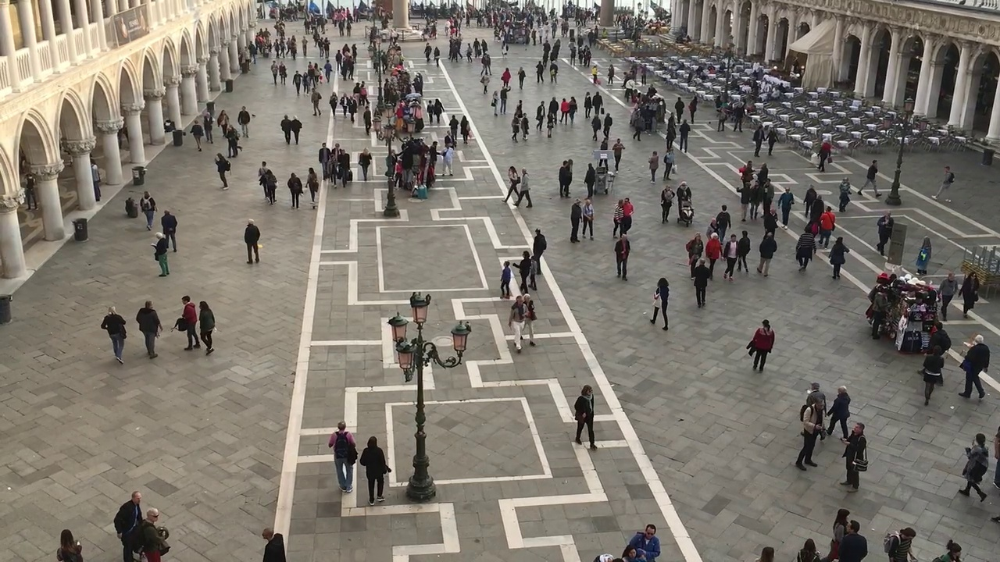
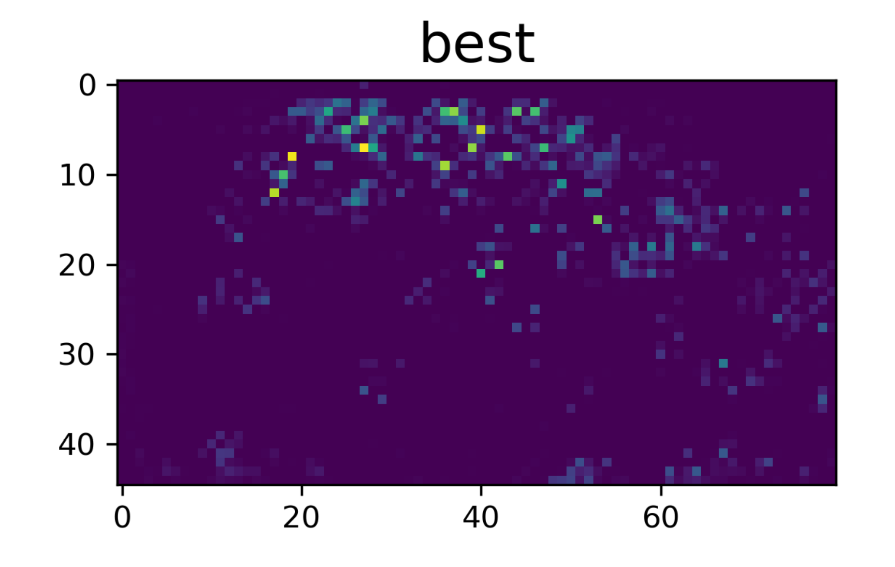
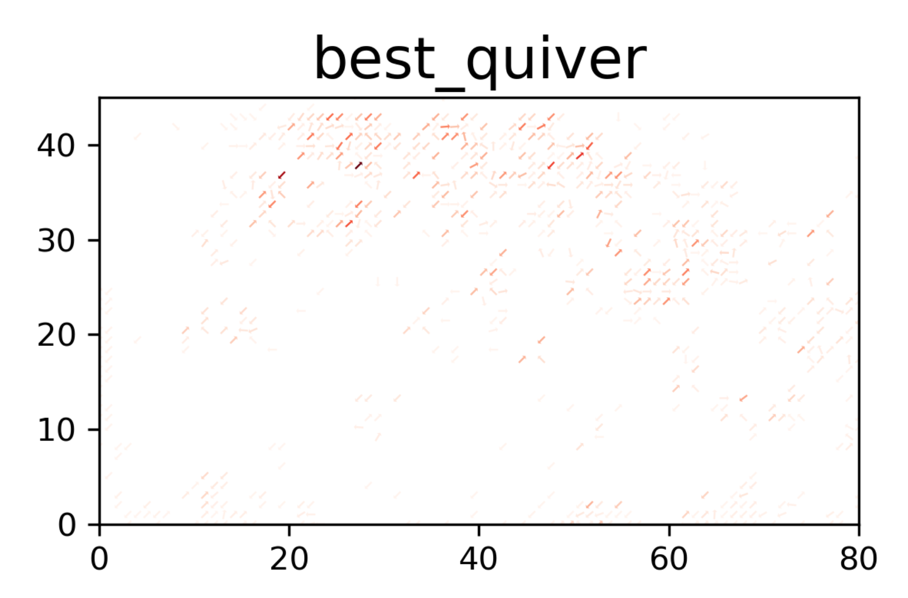

# 62nf-kaira-peopleflow

## デモの始め方
1. この[リンク](https://colab.research.google.com/github/hanebarla/62nf-kaira-peopleflow/blob/main/demo.ipynb)からGoogle Colabを開きます。
1. GPUを使えるようにします。`ランタイム > ランタイムのタイプを変更 > ハードウェアアクセラレータ > GPU `と設定してください。
1. 次にスクリプトを実行します。`ランタイム > すべてのセルを実行(Ctr + F9) `を実行してください。

### 注意点
* USBカメラでの動作のみを確認しています。

### 出力

一番上の出力はカメラで取り込んでいる画像を示しています。

人がどこに集まっているのかを示しています。
人が集まているほど赤に近づきます。

8方向で人の流れを示しています。
色の濃いほどより多くの人が流れています。

***
## 解説

***
## ありそうなQ&A
